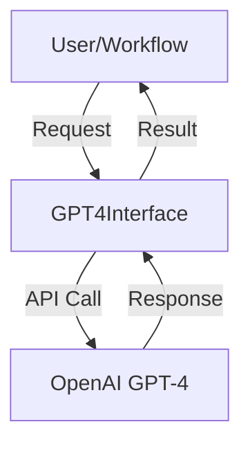

# AgentGPT: GPT-4 Interface


> **AgentGPT** is a Python interface for GPT-4 API integration, part of the Intelligent End-to-End Automation ecosystem. Designed to facilitate advanced AI integration into Web3 workflows, automation, and blockchain.

---

## 🚀 Key Features

| Feature           | Description                                                              |
|-------------------|--------------------------------------------------------------------------|
| GPT-4 Integration | Easy connection to OpenAI GPT-4 API                                      |
| Modular & Extensible | Easily extendable for automation and Web3 needs                        |
| Security          | No sensitive data storage, ready for open-source publication            |
| Full Documentation | Complete guide at [GitBook](https://agent-gpt.gitbook.io/agent-gpt)     |

---

## 📦 Installation

```bash
pip install gpt4-interface
```

---

## ⚡ Quick Start

```python
from gpt4_interface import GPT4Interface

api_key = "sk-..."  # Enter your OpenAI API key
agent = GPT4Interface(api_key)

response = agent.ask("What is AgentGPT?")
print(response)
```

---

## 🛠️ Architecture



---

## 📊 Integration & Ecosystem

| Component         | Status      | Description                           |
|-------------------|-------------|---------------------------------------|
| Web3 Automation   | Coming Soon | Blockchain & payment integration      |
| Agent Orchestration | Planned  | Multi-agent workflow                 |
| UI Dashboard      | Planned     | Visualization & monitoring            |

---

## 🌐 Links & Support

- 📧 Email: [support@agent-gpt.org](mailto:support@agent-gpt.org)
- 💬 Telegram: [@agentgptorg](https://t.me/agentgptorg)
- 🐦 X (Twitter): [@agentgptorg](https://x.com/agentgptorg)
- 💻 GitHub: [agentgptorg](https://github.com/agentgptorg)
- 📚 Documentation: [GitBook](https://agent-gpt.gitbook.io/agent-gpt)
- 🌍 Website: [agent-gpt.org](https://agent-gpt.org)

---

## 📝 License

MIT License

---

> Made with ❤️ by AgentGPT Team 